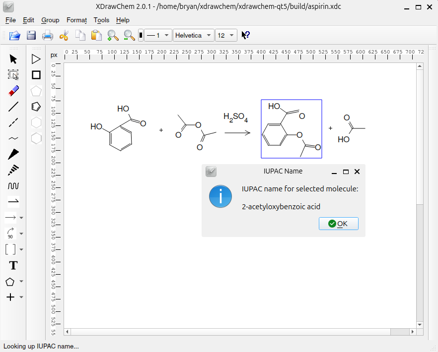

# XDrawChem: a 2D molecule drawing program

XDrawChem is an open-source application for drawing and editing
two-dimensional chemical structures. It supports CML, SMILES, MDL Mol,
CDXML, and its own XDC format, and integrates with OpenBabel for
cheminformatics calculations (SMILES, InChI, NMR prediction, 3D).



## Quick start

```bash
git clone https://github.com/bryanherger/xdrawchem
cd xdrawchem/xdrawchem-qt5
mkdir build && cd build
cmake .. -G Ninja -DCMAKE_BUILD_TYPE=Release
ninja
./xdrawchem
```

Requires **Qt 6.4+**, **OpenBabel 3.x**, and **CMake 3.19+**.
See [xdrawchem-qt5/README.md](xdrawchem-qt5/README.md) for full build instructions and dependencies.

## Repository layout

| Directory | Contents |
|---|---|
| `xdrawchem-qt5/` | **Current source** — Qt5 (qmake) and Qt6 (CMake) |

> **Looking for the legacy Qt3 or Qt4 codebases?**
> They were removed from `master` after v2.0.1 to simplify the repository.
> Check out [`v2.0`](https://github.com/bryanherger/xdrawchem/tree/v2.0)
> if you need them — `legacy-xdrawchem-qt3/` and `legacy-xdrawchem-qt4/`
> are preserved there and at every earlier tag.

## Links

- Releases: here on the right side of the page, and https://sourceforge.net/projects/xdrawchem/files/xdrawchem/
- Issues & PRs: here on GitHub, https://github.com/bryanherger/xdrawchem
- Backlog: See the [backlog](backlog.md) for known issues and possible enhancements.  Open an issue to add to the list.

Bryan Herger — bherger@users.sf.net
